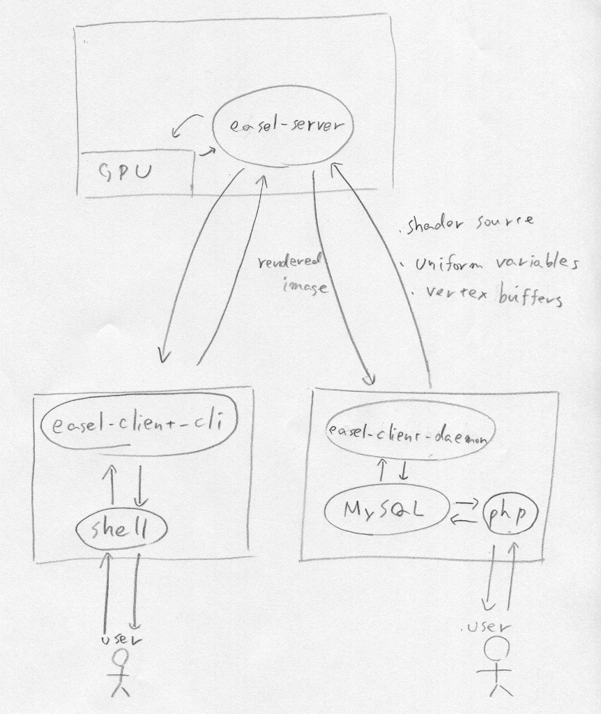

# easel - A remote image processing server

## Aims & Background

In our datacenter, there are two kinds of machines. Machines **with GPU**, and those **without GPU**.

This library lets machines w/o GPU utilize remote GPU power via [grpc](http://www.grpc.io/) protocol.

## Croquis



 - [Server](./server) must be installed to machines **with** GPU.  
 It accepts GLSL shaders, uniform variables (including textures), and vertexes, then render an image and send it back to clients.
 - [Client CLI](./client-cli) is a CLI version of client implementation.
 - [Client Daemon](./client-daemon) is a daemon version of client implementation. It monitors a [SQL table](https://github.com/ledyba/easel/blob/master/client-daemon/db.sql) and process images according to table entries. This daemon could be useful for PHP front-ends.

## Implementation

[/easel-server](./easel-server) the entrypoint of "server" executable.  
[/easel-client-cli](./easel-client-cli): the entrypoint of "client-cli" executable.  
[/easel-client-daemon](./easel-client-daemon): the entrypoint of "client-daemon" executable.

[/image-filters](./image-filters): GLSL shaders. Currently, there is only a [lanczos10 filter](https://github.com/ledyba/easel/blob/master/image-filters/lanczos.go).  
[/easel-server/impl](./server-impl):  
[/proto](./proto): grpc definitions.  
[/util](./util): utility functions.

[/test-images](./test-images): image materials for testing.  

## Known Issues

 - [lanczos10 filter](https://github.com/ledyba/easel/blob/master/image-filters/lanczos.go) cannot handles alpha channel correctly.

## How to run

### Common Prerequirements

 - [golang](https://golang.org/): Use latest version.

### Server

#### Prerequirements

```bash
# GLFW
sudo apt install libglfw3-dev
#
go get -u "github.com/go-gl/gl/v4.1-core/gl"
go get -u "github.com/go-gl/glfw/v3.2/glfw"
go get -u "github.com/Sirupsen/logrus"
go get -u "github.com/golang/protobuf/protoc-gen-go"
go get -u "google.golang.org/grpc"
go get -u "github.com/chai2010/webp"
go get -u "github.com/go-sql-driver/mysql"
```

#### Build


```
go get -u -d "github.com/ledyba/easel/easel-server"
go generate "github.com/ledyba/easel/easel-server"
go install "github.com/ledyba/easel/easel-server"
```

or, to cross-compile,
```
mkdir -p $GOPATH/src/githuc.com/ledyba/
cd $GOPATH/src/githuc.com/ledyba/
git clone "git@github.com:ledyba/easel.git"
cd easel
go generate "github.com/ledyba/easel/easel-server"
GOOS=linux GOARCH=amd64 go build -o easel-server "github.com/ledyba/easel/easel-server"
```

#### Create Certificates

```bash
# create self-signed ca
openssl req -new -x509 -days 3650 -newkey rsa:2048 -nodes -keyout ca.key -out ca.crt
# create client key
openssl req -new -newkey rsa:2048 -nodes -keyout client.key -out client.csr
# sign
openssl x509 -req -days 365 -in client.csr -CA ca.crt -CAkey ca.key -set_serial 01 -out client.crt
```

#### Command line flags
```
% ./bin/easel-server -h
Usage of ./easel-server:
  -cert string
    	cert file
  -cert_key string
    	private key file
  -help
    	Print help and exit
  -listen string
    	listen addr (default ":3000")
```

```
./easel-server \
    -cert=server.crt \
    -cert_key=server.key
    -listen "192.168.0.10:3000"
```

### Client Daemon

#### Build
```
go get -u -d "github.com/ledyba/easel/easel-client-daemon"
go generate "github.com/ledyba/easel/easel-client-daemon"
go install "github.com/ledyba/easel/easel-client-daemon"
```

or, to cross-compile,
```
mkdir -p $GOPATH/src/githuc.com/ledyba/
cd $GOPATH/src/githuc.com/ledyba/
git clone "git@github.com:ledyba/easel.git"
cd easel
go generate "github.com/ledyba/easel/easel-client-daemon"
GOOS=linux GOARCH=amd64 go build -o easel-client-daemon "github.com/ledyba/easel/easel-client-daemon"
```

#### Command line flags

```
% ./easel-client-daemon -h
Usage of ./easel-client-daemon:
 -cert string
     cert file
 -cert_key string
     private key file
 -db string
     db address (default "user:password@tcp(host:port)/dbname")
 -filter string
     applied filter name. (default "lanczos")
 -filter_lobes int
     lobes parameter (default 10)
 -help
     Print help and exit
 -server string
     server to connect (default "localhost:3000")
 -workers int
     workers to run (default 10)
```

Example:

```
easel-client-daemon \
    -cert=client.crt \
    -cert_key=cert.key \
    -db="test:hoge@tcp(localhost:3306)/easel" \
    -server="192.168.0.10:3000"
```

### Client CLI

#### Build
```
go get -u -d "github.com/ledyba/easel/easel-client-cli"
go generate "github.com/ledyba/easel/easel-client-cli"
go install "github.com/ledyba/easel/easel-client-cli"
```

or, to cross-compile,
```
mkdir -p $GOPATH/src/githuc.com/ledyba/
cd $GOPATH/src/githuc.com/ledyba/
git clone "git@github.com:ledyba/easel.git"
cd easel
go generate "github.com/ledyba/easel/easel-client-cli"
GOOS=linux GOARCH=amd64 go build -o easel-client-cli "github.com/ledyba/easel/easel-client-cli"
```


#### Command line flags

```
% ./easel-client-cli -h
Usage of ./easel-client-cli:
  -cert string
    	cert file
  -cert_key string
    	private key file
  -filter string
    	applied filter name. (default "lanczos")
  -filter_lobes int
    	lobes parameter (default 10)
  -help
    	Print help and exit
  -quality float
    	quality (default 95)
  -scale float
    	scale (default 2)
  -server string
    	server to connect (default "localhost:3000")
```

Example:

```
./easel-client-cli \
    -cert=client.crt \
    -cert_key=cert.key \
    test-images/momiji.png
```
